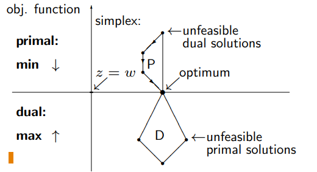

una rappresentazione diversa di un qualcosa che ci da delle informazioni non evidenti dalla rappresentazione iniziale. 
- Servirà per PL intera!

**NB**: Il problema duale ha lo stesso valore della soluzione del problema primale

**NB**: duality corresponds to an **involution**, a function that is its own inverse (i.e., such that f(f(x)) = x). Note indeed that, if we apply to the dual the same transformation that produced it, its dual coincides with the original problem.


### Interpretazione algebrica dell'algoritmo del simplesso
Differenza tra: 
- base B        == m colonne linearmente indipendenti della matrice A
- e tableau Y   == la matrice A a cui sono state applicate le operazioni elementari di riga per avere I in corrispondenza della base 

Il tableau si ottiene non solo tramite operazioni elementari di riga ma anche come: Y = B^-1 * A
- le colonne di A corrispondenti alla base si trasformano nella matrice identità

Il vettore dei costo (NON relativi) si ottiene come: z' = c'_beta * B^-1 * A (con ' ad indicare vettore riga)
- costi relativi ...
- criterio di ottimalità ...


**La dualità di un PL emerge dal criterio di ottimalità**:
- per la BFS ottima, il termine c'_b*B^-1 è l'unica incognita (dipende da quel'è la base ottima)
- il resto è un dato del problema
- possiamo allora chiamare c'_b*B^-1 -> **pi'**

abbiamo che pi' per definizione è una soluzione ammissibile al seguente nuovo problema che già puzza di duale:
- pi'*A <= c'  (notare l'uso di vettori riga al posto di vettori colonna)

Se ci inventiamo anche una nuova funzione obiettivo: max pi'*b (scambiamo i termini noti con i costi), ottienamo **il problema duale!**
```
    max pi'*b
    pi'*A <= c'
    con pi' <=> 0 -> variabile libera
```

- costi al posto dei termini noti
- max al posto di min
- termini noti al posto dei costi
- righe e colonne scambiate nella matrice dei vincoli
- un po' di altra roba

**conclusione**: è dimostrabile che la base B da cui siamo partite corrisponde ad una BFS ottimale <->  pi' = c'_b*B^-1 è una soluzione ottima al problema duale


...

es. 


la tabella è da imparare a memoria perchè aiuta

x <=> 0 -> variabile libera


nel problema duale i vincoli sono dati dalle colonne della matrice (e non più dalle righe)

- le relazioni sono tra vincolo primale e variabile duale (e viceversa)
- un vincolo forte primale mi da una condizione debole sulla variabile (e viceversa)


...


per risolvere un problema PL noi abbiamo solo il simplesso come tecnica e quindi il problema duale va trasformato in forma standard


## Dualità forte e dualità debole
che relazione c'è tra problema duale e primale?

**Theorem**
**HP**: If an LP has a finite optimal solution, then
1. its dual has a finite optimal solution; (dualità debole)
    - si può dimostrare vedendo che: **cost in the primal ≥ cost in the dual!**
    - **the dual cannot have an unbounded solution.**
2. the two solutions have the same value
    - questo si vede con un passaggio

La figura spacca: 

Relazione slide 11 molto importante:
- le soluzione ammissibili del primale sono >= rispetto alla soluzioni del duale
- le soluzioni del primale non sono ammissibili per il duale anche se gli farebbero gola e viceversa
- intuitivamente: solamente l'ottimo soddisfa sia i vincoli del duale che del primale


**Conclusione**: se il primale ha una BFS ottima allora ce l'ha anche il duale e i loro valori combaciano.
- **Rimangono i casi fuori dall'ipotesi!**


### Relazioni primale-duale:
abbiamo una matrice 3x3 che definisce le possibili coppie di relazioni primale duale
- caso standard è quello visto sopra in cui entrambi hanno un ottimo finito che ha valore coincidente
- non possono essere illimitati entrambi e non può essere che uno ha ottimo finito e l'altro è illimitato  (uno schiaccia l'altro)
    - **cost in the primal ≥ cost in the dual!**
    - oppure basta pensare che il duale del duale è il primale! Se uno ha ottimo finito, anche l'altro ce lo deve avere
- è possibile che i problemi siano **entrambi impossibili**
- è possibile che **uno sia illimitato e l'altro impossibile** (di nuovo, uno schiaccia l'altro)


### Come si interpreta il problema duale?
- al posto del allevatore considero un venditore
- al posto di n cibi considero m pillole con i nutrienti
- al posto di minimizzare la spesa, massimizzo il profitto
- ...

**foto sul telefono**


### Lemma di Farkas
Lemma usato nella teoria della dualità e nella dimostrazione di condizioni di fattibilità nei problemi di ottimizzazione.

Si tratta di un criterio di separazione tra un insieme di soluzioni ammissibili e un vincolo lineare. Il lemma dice che, data una matrice 𝐴 e un vettore 
𝑏:
- O il sistema ha una soluzione (cioè esiste un 𝑥 ≥ 0 che soddisfa 𝐴𝑥=𝑏),
- Oppure esiste un vettore 𝑦, soluzione del problema duale, che dimostra l'impossibilità della soluzione
    - intuitivamente, le soluzioni del problema duale sono illimitate dato che il primale risulta impossibile
    - se il duale si stacca da zero allora deve per forza deve andare a +inf (altri valori finiti dovrebbero essere uguali nel primale)


### Complementary slackness (condizioni di ortogonalità)
Fino ad ora sappiamo solo che primale e duale hanno lo stesso valore della soluzione.
- Come faccio a trovare la soluzione del duale data quella del primale/valore?
- lo strumento ce lo da il seguente teorema


- prodotto tra variabile duale e scarto primale deve valore zero
- viceversa

Complementary slackness implies that:
- ∀j : π′Aj < cj in the optimal solution to the dual, **we must have xj = 0 in the optimal solution to the primal**, and conversely
- ∀j : xj > 0 in the optimal solution to the primal, we must have π′Aj = cj in the optimal solution to the dual.
- Similar relationships between primal constraints and dual variables.

**conclusione**: Le condizioni di ortogonoalità ci **forniscono la soluzione di un problema** (primale o duale) data la soluzione del suo duale!


### Tableau e informazioni sulla dualità
...

- cj' = cj - pi*Aj ma gli Aj sono quelli di una matrice identità
    - recupero i pi_j
- in row 0, **in the columns corresponding to the initial basis**, we have cj = cj − πj, **from which we get the optimal dual solution** πj = cj − cj.
- **NB**: If the initial basis is provided by the artificial variables of Phase 1 (cost cj = 0), then πj = −cj.

**Altra OSS**: In the final tableau the columns of the initial base contain the inverse of the optimal base.
- per trovare i valori della soluzione del duale basta controllare i valori dei costi relativi delle colonne fuori base del **tableau finale**, e fare l'operazione descritta sopra
...

**conclusione**: il confronto tra il tableau iniziale e il tableua nella sua forma che trova la soluzione ottima mi permette di recuperare la soluzione ottima del problema duale!
- è per questo che non possiamo scartare le variabili artificiali, mi servono per il duale


## Algoritmo del simplesso duale
chiave per risolvere i problemi di PL intera

**Idea**: partiamo da una soluzione duale che è più che ottima per il primale, ma che non soddisfa i suoi vincoli. Poi cerchiamo di spostarla nella direzione dell'ammissibilità.

Questo si traduce in:

1. partire da una base **ammissibile per il duale** (prima riga con y_0j >= 0 per ogni j) ma **non ammissibile per il primale** (prima colonna con almeno un yi0 < 0)
    - soluzione duale che non soddisfa i vincoli del primale che cerchiamo di spostare
2. facciamo una operazione di **pivoting su una riga** (una con yi0 < 0)
    - il pivoting deve rendere positivo yi0 -> spostare la soluzione nella direzione dell'ammissibilità per il primale
    - stiamo lavorando con il duale su un tableau primale e quindi tutto è un pò girato
3. scegliamo un pivot nella riga in considerazione tra gli yij < 0 (prendiamo dei pivot negativi)
    - il pivot si sceglie come **max{y_0j / y_ij}** con j tale che yij **<** 0 
    - questa scelta garantisce il minimo incremento di costo e quindi ci fa stare sereni dato che evita di esagerare e di arrivare ad una soluzione ammissibile per il primale ma non ottima
    - **NB**: se tutti gli yij sono > 0, allora la soluzione per il primale **non esiste** (e il duale è illimitato)


**NB**: No “two-phase” method is needed, the dual simplex algorithm is normally used when:
- we are given the optimal tableau of a primal LP; 
- **one or more constraints are added so the solution becomes infeasible;**
- we want the new optimal solution without starting from scratch


## Analisi di sensitività
fino ad ora abbiamo visto la dualità come uno strumento teorico che ci servirà per la PL intera. Vediamo ora come la teoria della dualità ci porta a risolvere anche dei problemi molto pratici!

Con analisi di sensitività si intende: una metodologia con cui valutare il risultato della variazione di un dato di input

Concetto di **intervallo di confidenza** di un dato in input (A, b, c):
- se il dato varia all'interno del suo intervallo **la base rimane ottima**
- **NB**: la base non cambia, **ma la BFS e il suo valore si**. Questo però non è un problema in quanto entrambi sono facilmente ricalcolabili conoscendo la base ottima

Andiamo a vedere cosa succede se cambio una valore di _b_ o un costo _c_.
- ho due equazioni nel tableau: 
    - se cambio b si modifica la soluzione x0, **ma il criterio di ottimalità rimane soddisfatto!**
        - la base corrente rimane ottima se la soluzione rimane valida -> x0 = B^-1*b' >= 0 (con b' = b modificato)
    - se cambio un costo c, si modificano solamente i costi relativi ma la soluzione rimane valida 
        - la base corrente rimane ottima se il criterio di ottimalità rimane valido
        - notare che il valore della BFS può cambiare solamente se si modifica un costo relativo ad una variabile in base

**OSS**: We will not see how to determine the confidence intervals: they are provided by any software for linear programming
**OSS**: The analysis becomes more complex when more values are changed at the same time: it is frequently better to solve the LP with the new data.
**OSS**: se facendo un analisi di sensitività finisco nel caso negativo (uno dei due) non sto dicendo che non mi conviene far variare un dato di input, piuttosto, semplicemente devo ricalcolare la soluzione ottima.


### Prezzi ombra
considera il seguente problema: dato un vettore di termini noti b relativo ai vincoli di un problema di produzione (PL), e una determinata funzione di profitto, con il simplesso noi siamo in grado di trovare la soluzione ottima, ovvero quella che da il profitto maggiore. Spesso però il vettore b dei limiti non è un fissato rigidamente ma è flessibile, ci si potrebbe allora chiedere se potrebbe convenire modificare un certo limite b_i (ad esempio produrre di più/meno) considerando sia il costo della modifica che la soluzione ottima corrente.

**Definition**: the shadow price for resource i is the increase of the objective function value the could be obtained by increasing the available amount bi of the resource **di un unità(a quanto pare)**, **provided the new value lies inside the confidence interval of the sensitivity analysis**.
- Why do we use the term “price” for a profit increase?
- When a shadow price is positive, the cost of the resource increase must be considered. 
- For example, suppose the shadow price for resource i is 3:
    - if the unit cost for increasing the resource is lower than 3 then increasing it would be convenient, otherwise it would not.
- **Shadow price = maximum price we are willing to pay for each additional unit of a resource.**


### Prezzi ombra e dualità
La dualità offre una tecnica immediata per determinare i prezzi ombra:
- Remind: The objective function of the dual is __π′*b__; primal and dual optimal solutions have the same value.
- the objective function coefficient for πi is bi (the right-end side of primal constraint i). Hence
- **Property**: the optimal value of dual variable πi is the shadow price for primal constraint i
    - siccome soluzione ottima primale e duale hanno lo stesso valore, l'incremento unitario di bi mi fa aumentare il valore della soluzione duale (e quindi anche del primale) di πi.
    - ma questa è proprio la definizione di shadow price 


prezzi ombra e funzione obiettivo del problema duale (che mi darà lo stesso valore della funzione obiettivo del primale)


**Algoritmo primale duale da saltare... godo**