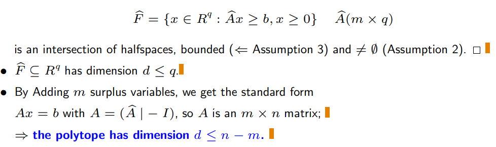

## Risoluzione grafica in R2
When a linear programming problem involves only two variables, it can be solved through a geometric approach

**NB**: saper risolvere graficamente un problema di programmazione lineare serve anche durante il compito

**trucco**: con variabili multiple, considerane una e azzera le altre

Le rette parallele **si spostano nella direzione del gradiente!**
- la soluzione ottima di solito si posiziona in un vertice delle spazio ammissibile 
- mi interessano solo i vertici?
    - No le soluzioni ottime possono anche risiedere su uno spigolo 
    - ma allora risiedono anche su due vertici (it is enough to consider the vertices to find an optimal solution!)

**Conclusione**: i vertici dello spazio ammissibile sembrano essere i punti in cui andare a cercare le soluzioni ottime!

## Forme di programmazione lineare

**simboli**
- A == matrice m*n dei vincoli
    - m == numero righe   == numero vincoli
    - n == numero colonne == numero variabili
    - i == indice di riga
        - a'_i == riga i-esima di A
    - j == indice di colonna
        - A_j == colonna j-esima di A
- c == vettore dei coefficienti della funzione obiettivo
    - c' == vettore riga
    - n elementi
- x == vettore delle variabili decisionali
    - n elementi
- b == vettore dei termini noti
    - m elementi

- **FORMA GENERALE**
    - i vincoli possono essere sia equazioni che disequazioni
        - per le disequazioni si preferisce considerare solo quelle >=; tanto se a <= b <-> -a >= -b
    - le variabili decisionali possono essere >= zero, ma anche </>/= di zero

- **FORMA CANONICA**
    - i vincoli sono espressi solo da disequazioni (Ax >= b)
    - variabili decisionali sempre >= 0

- **FORMA STANDARD**
    - i vincoli sono espressi solo da equazioni (Ax = b)
    - variabili decisionali sempre >= 0

**NB**: The simplex algorithm solves problems in standard form with m < n. Sembra quindi che l'algoritmo del simplesso sia limitato nella classe di problemi che è in grado di risolvere. In realtà NO! **Non c'è perdita di generalità nel considerare solo queste sottoclassi di problemi**. Questo si verifica mostrando:
- m >= n non è un caso di interesse
    - sistemi con m > n non hanno soluzioni e quindi non ha senso considerarli
    - sistemi con m = n hanno **una sola soluzione** 
        - non c'è niente da cercare
        - il problema si risolve invertendo la matrice A -> x = A^-1*b (chiaramente la matrice A deve essere invertibile)
    - **sistemi con m < n hanno infinite soluzioni** (caso interessante) 
        - n-m gradi di libertà, n-m variabili che possono assumere un valore arbitrario ottenendo una soluzione comunque valida
        - esistono infinite soluzioni valide, bisogna trovare quella ottima

- le 3 forme (generale, canonica, standard) sono equivalenti:
    - generale a canonica:
        - i vincoli di equazione li sostituisco con due disequazioni (a = b <-> a >= b, a <= b (<-> -a >= -b se si vuole mantenere il >=))
            - notare che sto aumentando m 
    - generale a standard:
        - i vincoli di disequazioni li sostituiscono con delle equazioni e delle variabili di surplus/slack (una per constraint) 
            - notare che sto aumentando n 
    - per entrambi, x_j+ e x_j- sono sempre positivi e sostituiscono x_j laddove esso è </=/> di zero (x_j scompare)
        - notare che sto aumentando n
    

**Conclusione**: L'algoritmo del simplesso quindi funziona senza perdità di generalità con problemi in forma standard con m < n
Inoltre:
- forma canonica si presta per esempi grafici (ha poche variabili)
- forma standard si presta per algoritmi (algoritmo del simplesso)

### Ripasso Indipendenza lineare
3 caratterizzazioni che verificano l'assenza di indipendenza lineare (utili per le DIM)
...
- la matrice non è invertibile (singolare, avrei bisogno del determinante a denominatore)

Rango di una matrice quadrata: numero delle sue righe/colonne linearmente indipendenti

# FONDAMENTALE | Soluzione Base e soluzione base ammissibile
Abbiamo che una base B della matrice A è una matrice formata da m colonne linearmente indipendenti di A.
- **ASSUZIONE**: A deve avere m colonne linearmente indipendenti
- B è una matrice quadrata invertibile

**NB**: L'assunzione delle colonne linearmente indipendenti è un debito! L'algoritmo a cui arriveremo dovrà anche dirmi se l'assunzione non è verificata

Una soluzione base x del sistema è una soluzione tale che:
- le variabili corrispondenti ad indici che corrispondono a colonne non comprese nella base valgono zero
- le variabili rimanenti hanno come valore la soluzione del sistema definito dalla base
    - siccome è quadrata la soluzione è soltanto una x_k = k-esima componente di B^-1*b

**NB**: una soluzione base ottenuta in questa maniera
- soddisfa sicuramente A*x = b
- non necessariamente soddisfa x >= 0 (richisto dalla forma standard)

Definiamo allora **soluzione base ammissibile** (BFS, Basic Feasible Solution): una soluzione base che appartiene alla regione ammissibile dei problemi in forma standard (tuti gli x : A*x=b; x >= 0) 

**OSS**: A*x = b (con x>=0) mi definisce la regione ammissibile F 

Altre due assuzioni (debiti):
- F != null
- in F la funzione obiettivo è limitata inferiormente. In altre parole esiste effettivamente un ottimo e non si può andare all'infinito
    - come conseguenza anche **lo spazio ammissibile F è limitato** in quanto la funzione obiettivo è lineare (non può produrre comportamenti asintotici) 

## Politopi convessi
(sinonimo di poliedro)

... def di iperpiano ...
- un iperpiano divide lo spazio in due semi-spazi
    - **NB**: la definzione di un semi-spazio ha la stessa forma di un vincolo in un problema di programmazione lineare
- un semi-spazio è un insieme convesso (se prendo due punti non posso mai uscire)
- **l'intersezione di semi-spazi è convessa**

**DEF| Politopo convesso**:
spazio definito dall'intersezione di un numero finito di semi-spazi se limitato e non vuoto
- (sto scolpendo il politopo tagliando via lo spazio attorno)
- **NB**: i vincoli di un problema di programmazione lineare definiscono uno spazio ammissibile che è un politopo
    - particolarmente visibile in forma canonica

**terminologia sui politopi**:
- Dimensione del politopo       = dimensione minima dello spazio che lo contiene
- faccia del politopo           = intersezione tra politopo ed un semispazio
    - l'iperpiano che mi definisce una faccia si appoggia su uno spigolo/vertice/piano/... del politopo
- faccetta del politopo         = faccia di dimensione d-1
- spigolo                       = faccia di dimensione 1
- vertice                       = faccia di dimensione 0 

**combinazione convessa di p punti**: 
- generalizzazione della combinazione convessa di due punti
    - al posto di lambda abbiamo p parametri alpha la cui somma fa 1
- non più solo i punti appartenenti al segmento che congiunge due punti, ma anche tutti i punti che appartengono all'area/volume/spazio in generalre p-1 dimensionale definito dai p punti

**PROP**: Ogni punto di un politopo è una combinazione convessa dei suoi vertici (e viceversa, la combinazione convessa dei vertici forma solo punti del politopo)

**PROP 2**: Un vertice NON è una combinazione convessa stretta (0 < lambda < 1) di due altri punti del politopo

Abbiamo gia visto osservando la forma canonica che i vincoli di un LP definiscono un politopo. Definiamo meglio come è fatto questo politopo:

- la matrice identità (delle variabili surplus) è m*m
- A è quindi una matrice m*n con n = q+m -> q = n-m
- **il politopo ha dimensione d <= q = n-m** (gradi di libertà della matrice)

Property The constraints of an LP define a polytope.

## Politopi e programmazione lineare:
congiungiamo le due strade (algebrica e grafica/geometrica)

**Relazione fondamentale tra vertici e soluzioni base ammissibili**:
Given the polytope P defined by the constraints of an LP, a necessary and sufficient condition for a point to be a vertex is that the corresponding vector x be a BFS.
- le soluzioni base ammissibili sono vertici del politopo e i vertici del politopo sono soluzioni base ammissibili
- questo conferma l'intuizione grafica iniziale la soluzione ottima va cercata esplorando i vertici del politopo 

**TEOREMA**:
per ogni LP esiste un vertice ottimo (ovvero un BFS ottimo)

- non abbiamo dimostrato che il punto è un vertice, però il suo valore è ottimo
    - funzione obiettivo parallela ad uno spigolo
    - da qui deriva il corollario: ogni combinazione convessa di di vertici ottimi è ottima (pensa allo spigolo dell'esempio iniziale)

Dalla relazione e dal teorema **abbiamo ottenuto un algoritmo (naive) per risolvere tutti i problemi di programmazione lineare!**
- esaminiamo tutti i vertici del politopo
- ovvero, tutte le BFS di A*x = b
- ovvero, binomio di newton (m su n) combinazioni di m colonne sulla matrice A dove, calcolando l'inversa, B^-1*b = x con tutte le componenti >= 0

(con l'algoritmo del simplesso non considereremo solamente tutti i vertici del politopo, ma solo un piccolo sottoinsieme)

### Basi degeneri:
Una base determina unicamente un BFS (il BFS si ottiene invertendo la base)
- di conseguenza: **se BFS' != BFS'' => B' != B''**
- ma è vero il contrario? se  **B' != B'' => se BFS' != BFS''**? NO!

**DEF**: A BFS is called degenerate if it contains more than n − m zeroes

**Theorem**: If two distinct bases B′ and B′′ correspond to the same BFS x, then x is degenerate

intuizione: un'algoritmo pensa di star cambiando vertice quando cambia la base, ma in realtà può rimanere nello stesso punto e star facendo fatica inutilmente