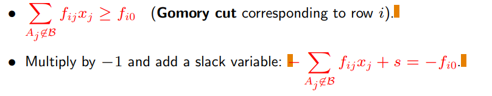

Abbiamo che alle variabili, oltre al vincolo >=, viene applicato un ulteriore vincolo di interezza: x integer

**OSS FONDAMENTALE**
se rimuovo il vincolo di interezza ottengo il **rilassamento continuo del problema** che so gia risolvere con il simplesso
- se il problema è di minimo -> **il valore della soluzione del rilassamento è sicuramente non peggiore di quello del problema iniziale**
    - ho un vincolo in meno
    - z(LP) <= z(ILP); è un lowerbound 

Se la soluzione ottima di z(LP) è intera allora la stessa soluzione risolve anche z(ILP), in caso contrario bisogna lavorare...

Ci sono due tecniche per risolvere ILP

### Metodo dei piani di taglio
Idea: 
- risolvo il rilassamento continuo del problema
- se la soluzione x* è gia intera, a posto
- altrimenti, aggiungo un vincolo lineare (taglio) tale che
    - elimino la parte della regione ammissibile contenente x*
    - ma non elimino nessuno soluzione ammissibile intera
- reitero risolvendo il nuovo problema con il taglio finchè non ottengo una soluzione intera

Semplice, ma come ottengo i tagli da applicare?

**def | parte intera di y**: l'intero q : q <= y (se y positivo == troncamento)
**def | parte frazionaria**: valore reale - parte intera -> f_ij = y_ij - int(y_ij) (chiaramente, sempre compreso tra 0 e 1)

**Tagli di Gomory**
per ogni riga del tableau:

- se voglio inserire nel tableau i nuovi vincoli dei tagli di gomory mi è più comodo moltiplicare per -1 ed aggiungere una variabile di slack
- tutti le feasible integer solution rimangono ammissibili in quanto ho utilizzato delle relazioni già presenti nel tableau (semplicemente abbiamo aggiunto vincoli di interezza)

Dopo aver aggiunto un taglio al LP, abbiamo una soluzione primal unfeasible (yi0 < 0) e dual feasible (yoj >= 0) (dimostrabile), **possiamo quindi applicare il simplesso duale**!
- oppure ripartire da zero (ma chiaramente non conviene in quanto "basta che ci spostiamo poco")
- la riga scelta per produrre il taglio si chiama **riga generatrice**
- le righe generatrici sono tutte possibili sono tutte quelle con y_i0 frazionari

nota: anche nella riga zero non vogliamo valori frazionari siccome una combinazione lineare (coefficienti interi) con variabili intere non può produrre un valore frazionario

- per disegnare i tagli (ho bisogno del taglio sotto forma di disequazione) si fanno delle sostituzioni in modo da avere i tagli in funzione delle sole variabili di decisione (no slack/surplus ecc...)
- va considerata anche la riga 0, quella dei costi nei tagli

**NB**: con questi tagli non ci sono più valori frazionari nel tableau 

**Convergence**
It can be proved that, even in case of degeneration, the method converges if:
- the generating row is selected as the **first fractional row**;
- the dual simplex pivot is selected according to a method analogous to **Bland’s rule**.

OSS:
When the continuous relaxation of the ILP is unbounded, “normally” the ILP is unbounded as well, but in very particular cases (quando la regione ammissibile del rilassato non contiene punti interi) it can be impossible.

### Metodo branch and bound
si parte in maniera simile a prima 
- risolvo il rilassamento continuo del problema
- se la soluzione x* è gia intera, a posto
- altrimenti ...

Bisogna scegliere una componente frazionaria xj* della soluzione del rilassato x* e considerare due condizioni mutamente esclusive (se si verifica una non si verifica l'altra) ed esaustive (non eliminano possibili soluzioni intera)
- **xj <= int(xj*) or xj >= int(xj*) +1**
- In pratica, non considero la parte di regione ammissibile in mezzo a due soluzioni intere dato che contiene solo soluzioni frazionarie

Imponendo o una o l'altra condizione (mutex), ottengo due nuovi ILP (**branching**) 
- da una parte complico il problema dato che invece di un ILP ne devo risolvere due
- dall'altra anche l'unione dei due politopi è più piccola di quella del problema iniziale (devo cercare di meno)

La soluzione del problema di partenza è la migliore tra i due problemi derivati
- **NB**: i problemi derivati si risolvono a loro volta in maniera ricorsiva riapplicando il branching, fino ad arrivare al caso base in cui si trova una soluzione intera 

**pruning dell'albero (bounding)**
ricorda che il valore della soluzione del problema rilassato i (Li) è per forza <= del valore della soluzione del problema con il vincolo di interezza (zi)  
- siccome i costi c sono tutti interi,  ceil(Li) <= zi

**NB**: se abbiamo già trovato una soluzione di valore z <= ceil(Li) che stiamo considerando adesso, allora non dobbiamo neanche continuare con i figli di Pi
- questo perchè le soluzioni che troveremo zi saranno sicuramente peggiori di Li che abbiamo già battuto da qualche altra parte

**conclusione**: nell'albero lo studio dei lower bound mi aiuta a trovare la soluzione intera potando rami dell'albero (parte di bounding)

**branch & bound nel tableau**
guarda le slide che fai prima

## Strategie di esplorazione in branch & bound

...

**lowest bound first**
...

interessante la difficoltà implementativa dell'algoritmo, che durante il backtracking ha necessità di eliminare svariati vincoli durante la risalita

...

**bfs**
...

usata raramente, ma occasionalmente utile se si ha bisogno di conoscere tutte le soluzioni ottime e magari anche alcune non ottime leggermente peggiori (magari costano molto meno considerando altre condizioni)

### MILP
con l'algoritmo branch and bound siamo già a posto
- mi basta scegliere per il branching solamente le variabili che devono assumere valori interi

con i tagli di gomory un po più difficile
- la formula di gomory per i tagli rischia di tagliare via pezzi di politopo che contengono i valori ottimi per le variabili frazionarie
- non è difficile modificare i tagli

se mischiamo con tagli di gomory modificati con branch and bound (**branch and cut**) ottieniamo lo stato dell'arte non solo per MILP ma anche per ILP

### Binary integer linear programming

**knapsack problem (zaino)**
scegliere quali oggetti (variabili) mettere nello zaino

**regole di branching**

**regole di bounding**
non c'è bisogno del simplesso, basta usare una frazione quando ho quasi riempito lo zaino
-> upper bound di Dantzig

oss: anche la strategia di branching segue la stessa logica, continua a mettere fino a che non trova l'elemento critico